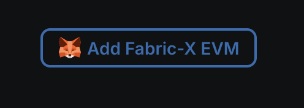
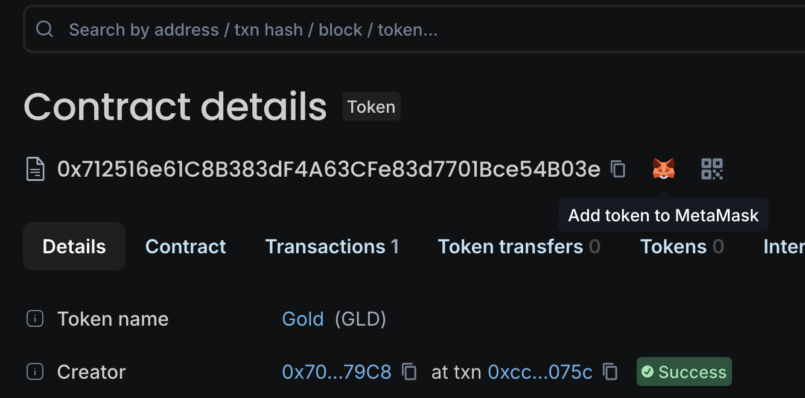

<!--
SPDX-License-Identifier: Apache-2.0 AND LGPL-3.0-or-later
-->

# fabric-x-evm

fabric-x-evm makes Hyperledger Fabric-x (and Fabric) compatible with the
Ethereum ecosystem by providing an Ethereum-style JSON-RPC API and native
support for EVM smart contracts within Fabric's permissioned environment. This
integration combines the rich Ethereum tooling and contract ecosystem with
Fabric's robust endorsement and consensus model.

By embedding an Ethereum Virtual Machine (EVM) inside Fabric, developers can
deploy and execute existing Ethereum smart contracts without modification,
while benefiting from Fabric's enterprise-grade features including fine-grained
access control, privacy, and deterministic consensus. The solution preserves
Fabric's transaction flow, trust guarantees, and high performance while
enabling seamless use of the Ethereum development toolchain—including Solidity,
Hardhat, Foundry, and MetaMask.

This approach broadens Fabric's appeal and lowers the barrier for organizations
that want to leverage existing Ethereum assets, developer expertise, and
tooling in a permissioned, enterprise blockchain setting.

## Design

[Here](docs/ARCHITECTURE.md)

## Quick start

Stand up a full Fabric-X EVM network with a block explorer in two commands:

```shell
make init-x   # generate crypto material (one-time)
make start    # start the network + Blockscout explorer
```

Once the stack is up, open the block explorer at **http://localhost:8000** and
point any Ethereum tooling to **http://localhost:8545** (chain ID `4011`).
You can now use the system as any other EVM-style chain! Backed by Fabric-X.

> [!NOTE]
> `make start` builds the gateway image locally, so the first run takes a
> minute or two. Subsequent starts are fast. To run without the block explorer,
> use `make start-node` instead.

### Deploy a token and interact via MetaMask

You'll need:
- [cast](https://book.getfoundry.sh/getting-started/installation) (part of Foundry)
- [MetaMask](https://metamask.io/) browser extension

The commands below use built-in test accounts — gas is free so no prefunding is
needed. Substitute any address or private key if you prefer your own accounts.

To use MetaMask with the test wallet, import this private key
([instructions](https://support.metamask.io/start/use-an-existing-wallet/#import-using-a-private-key)):
open the extension → your account → Add Wallet → Private Key, and enter
`0xac0974bec39a17e36ba4a6b4d238ff944bacb478cbed5efcae784d7bf4f2ff80`.

> [!WARNING]
> This is the well-known Hardhat account #0. **Never use it on a public
> network** — it will be drained instantly.

> [!IMPORTANT]
> If you've used MetaMask with this network before and restarted with a clean
> state, reset the account: Settings → Developer tools → Delete activity and nonce data.

#### Deploy a token

Deploy an ERC-20 token by choosing a name and symbol:

```shell
make demo-deploy NAME="Digital Euro" SYMBOL=DEUR
```

The explorer URL is printed immediately:

```
Deployed Digital Euro (DEUR): http://localhost:8000/address/0x...
```

Open the URL. Scroll to the bottom and click **"Add Fabric-X EVM"** 
to add the network to MetaMask (only needed once):



Then click the MetaMask logo next to the token contract address to add the
token to your wallet:



#### Transfer tokens

Copy your MetaMask address and run:

```shell
make demo-transfer TO=0xf39Fd6e51aad88F6F4ce6aB8827279cffFb92266 AMOUNT=500
```

The transaction URL is printed immediately:

```
Transferred 500 tokens to 0x...: http://localhost:8000/tx/0x...
```

Switch to MetaMask and confirm the tokens arrived. Try sending some back —
there's no gas cost, so experimenting is free.

**You're now running your own Fabric-X EVM network.** Deploy your own contracts
with tooling you're familiar with, or explore the [architecture](./docs/ARCHITECTURE.md)
and [compatibility](./docs/COMPATIBILITY.md) docs to learn more.

To stop the network and delete the ledger, do:

```shell
make stop
```

Reset your Metamask wallet in Settings → Developer tools → Delete activity and nonce data.

# Testing

## Unit tests

```shell
make unit-tests
```

## Integration tests

Some integration tests rely on the `ethereum/tests` corpus vendored as a git
submodule under `testdata/ethereum-tests`. Initialize it once before running
those tests:

```shell
git submodule update --init --recursive
```

### Local

The simplest integration tests don't require a Fabric network, but still
exercise the basic functionality of creating read/write sets out of EVM
transactions, and subsequently reading them.

```shell
make test-local
```

### Fabric-X

Generate the crypto material once:

```shell
make init-x
```

Then start the Fabric-X testcontainer and create the namespace, run the
integration tests against it, and stop it again:

```shell
make start-x
make test-x
make stop-x
```

The container does not keep state.

### Fablo

Start the network, run the integration tests, and stop it again:

```shell
make start-fablo
make test-fablo
make stop-fablo
```

## Compile other smart contracts

Example contracts are provided in the `solidity/` directory. Requires [solc](https://docs.soliditylang.org/en/latest/installing-solidity.html) (`brew install solidity`).

To recompile the `Token` contract used by `make demo-deploy`:

```shell
cd solidity/OzepERC20 && npm install && cd ../..

solc --bin --overwrite -o testdata \
  --base-path solidity/OzepERC20 \
  --include-path solidity/OzepERC20/node_modules \
  solidity/OzepERC20/Token.sol
```

## License

This repository uses different licenses for different components:

- **Go code**: All Go source code in this repository is released under **LGPL-3.0-or-later** (see `LICENSE.LGPL3`)
- **Scripts**: All scripts are released under **Apache-2.0** (see `LICENSE.Apache2`)

## SPDX License Expression

```
SPDX-License-Identifier: Apache-2.0 AND LGPL-3.0-or-later
```
