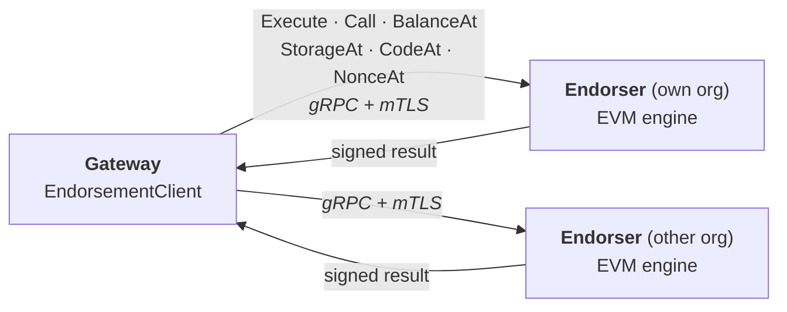

# Endorsement API

The endorser exposes a gRPC API, `EvmEndorsement`, that the gateway uses to
execute Ethereum transactions and read state. It is specific to fabric-x-evm
rather than a generic endorsement protocol: requests carry only what the
endorser needs, and the gateway assembles the Fabric transaction envelope.

Schema: [`api/endorsementpb/endorsement.proto`](../api/endorsementpb/endorsement.proto).

## Table of Contents

- [Architecture](#architecture)
- [Service](#service)
- [Messages](#messages)
- [Endorsement](#endorsement)
- [Errors](#errors)
- [Security](#security)
- [Resilience](#resilience)
- [Configuration](#configuration)
- [Testing](#testing)

## Architecture

The gateway holds one client per endorser it collects endorsements from, and
reaches every one of them over gRPC:



Both sides of the boundary are the same contract, the
[`endorser/api.Service`](../endorser/api/service.go) interface. The in-process
endorser implements it directly, and the gRPC client implements it by calling a
remote endorser, so the gateway's fan-out, error ordering and parallelism are
identical either way.

A gateway can run its endorser embedded in the same process, or dial endorsers
as separate processes. See [Configuration](#configuration).

## Service

One RPC per engine function. Only `Execute` produces an endorsement; the reads
return plain values.

| RPC | Purpose |
|---|---|
| `Execute` | Execute and endorse an Ethereum transaction |
| `Call` | Read-only `eth_call` |
| `BalanceAt` | Account balance |
| `StorageAt` | Storage word at a key |
| `CodeAt` | Contract code |
| `NonceAt` | Account nonce |

Separate reads, rather than one query RPC with a type enum, keep every request
and response fully typed: a storage key cannot be sent on a balance query, and
each response says exactly what it is.

## Messages

**`ExecuteRequest`** carries the marshaled Ethereum transaction
(`types.Transaction.MarshalBinary`), which is all the endorser needs since it
re-derives the sender from the signature and executes against its own state. It
also carries the invocation the endorsement builder consumes, and a proposal
hash.

The proposal hash is required by classic Fabric, whose submitted payload must
carry it. Fabric-X does not need the proposal, so the field is empty there and
the full proposal never crosses the wire.

**`ExecuteResponse`** carries the execution result and the endorser's signature
over it:

| Field | Meaning |
|---|---|
| `read_write_set` | The signed endorsed result, byte-exact, which the packager assembles the transaction from |
| `event` | Optional event |
| `status`, `message`, `payload` | Execution outcome and EVM return data |
| `endorser_id`, `signature` | Serialized identity of the signer, and its signature |

`read_write_set` and `payload` are distinct: the former is what was signed and
what the transaction is built from, the latter is the EVM return data. Both are
needed.

**`CallRequest`/`CallResponse`** carry the `ethereum.CallMsg` fields (from, to,
gas, gas price, value, data) and a block selector; the response is the return
data, plus a status and message when the call did not succeed.

**State reads** take an account (plus a storage key for `StorageAt`) and a block
selector, and return a single typed value. Addresses are 20 bytes, storage keys
and words 32 bytes, and integers big-endian bytes. An absent block selector
means latest.

## Endorsement

`Execute` is the only RPC whose result feeds a Fabric transaction, so it is the
only one that is signed. The endorser signs the execution result and returns it
with its serialized identity; the gateway collects one such response per
endorser and packages them into the transaction it submits.

Whether a transaction commits then depends on the namespace's endorsement
policy: a policy of `AND('Org1MSP.member','Org2MSP.member')` requires a signed
response from an endorser of each organization.

`api.Service.Execute` currently returns a `*peer.ProposalResponse`, because both
SDK packagers require one. Dropping it on the Fabric-X path, where the proposal
is not needed, is follow-up work.

## Errors

Application outcomes and transport faults travel on separate channels.

**Application outcomes** ride in the response status. The RPC itself succeeds;
the result carries the outcome. Status codes are defined in
[`common/proposal.go`](../common/proposal.go):

| Status | Meaning |
|---|---|
| `200` | Success |
| `201` | EVM reverted; still endorsed and committed, receipt records `status=0` |
| `400` | Invalid transaction, rejected before execution (nonce, funds, intrinsic gas, signature) |
| `460` | Valid transaction whose EVM execution failed (out of gas, invalid opcode) |
| `500` | Server-side fault, such as a signing failure |

**Transport faults** travel as gRPC status errors, and only these ever surface
as a Go error:

| gRPC code | Meaning | Retryable |
|---|---|---|
| `UNAVAILABLE` | Endorser unreachable | yes |
| `DEADLINE_EXCEEDED` | Call timed out | yes |
| `INTERNAL` | Transport fault | no |

The separation matters because a revert is a successful RPC carrying a
committed outcome, while an unreachable endorser is not an endorsement outcome
at all. Application statuses are never retried; only transport faults are.

The gateway maps these onto the Ethereum JSON-RPC surface it exposes, which is
unchanged by the endorsement API. See [JSON_RPC_ERRORS.md](JSON_RPC_ERRORS.md).

## Security

**mTLS is required.** Both sides present certificates: the gateway
authenticates the endorser, and the endorser authenticates the gateway. There is
no plaintext or server-only-TLS fallback.

The client identity is the mTLS peer certificate. An endorser accepts only
connections whose certificate chains to one of its trusted organization CAs,
listed in `ca-cert-paths` - which is how one organization's gateway is able to
reach another organization's endorser.

mTLS is the authorization boundary: the endorser is not a public endpoint and
trust is the CA list. Finer-grained per-client authorization can be layered on
later.

Transport identity and endorsement identity are separate concerns. mTLS governs
*who may call*; the MSP identity the endorser signs with governs *who endorsed*.
An endorser may present one organization's TLS certificate while signing with
another organization's MSP identity, and it is the signing identity that the
endorsement policy is evaluated against.

Certificates are verified against the configured `server-name` when one is set,
rather than against the dial address. Endorser certificates are normally issued
for a hostname, so this is what allows an endorser to be reached by IP.

## Resilience

- **Deadlines** are the caller's: the RPC honors the incoming context deadline.
- **Retries** live with the caller. The endorser is stateless, with no
  server-side retry or idempotency keys.
- **Connections** are long-lived and pooled, rather than dialed per call.
- **Backpressure** is bounded in-flight requests and max concurrent streams,
  surfacing overload as `RESOURCE_EXHAUSTED`.

## Configuration

### Endorser

An endorser that serves gRPC needs an endpoint and TLS material:

```yaml
endorser:
  name: org1
  identity:
    msp-id: Org1MSP
    msp-dir: /crypto/peerOrganizations/org1.example.com/peers/endorser.org1.example.com/msp
  committer:
    endpoint:
      host: committer.org1.example.com
      port: 4001
    tls:
      mode: mtls
      cert-path: /crypto/.../client.crt
      key-path: /crypto/.../client.key
      ca-cert-paths:
        - /crypto/.../tlsca.org1.example.com-cert.pem
  database:
    database: memory
```

The gRPC server itself is configured with an endpoint, mTLS, keep-alive,
max-concurrent-streams and rate limiting. Its bootstrap - listen, TLS,
interceptors, health - comes from the `serve` package in fabric-x-committer;
it moves to fabric-x-common once published there.

The endorser's `committer` connection is how it stays in sync with committed
blocks. It is separate from the gRPC server the gateway dials.

### Gateway

`gateway.endorsers` lists the endorsers to dial, each an endpoint plus TLS:

```yaml
gateway:
  endorsers:
    - endpoint:
        host: endorser.org1.example.com
        port: 9001
      tls:
        mode: mtls
        server-name: endorser.org1.example.com
        cert-path: /crypto/.../client.crt
        key-path: /crypto/.../client.key
        ca-cert-paths:
          - /crypto/.../tlsca.org1.example.com-cert.pem
    - endpoint:
        host: endorser.org2.example.com
        port: 9001
      tls:
        mode: mtls
        server-name: endorser.org2.example.com
        cert-path: /crypto/.../client.crt
        key-path: /crypto/.../client.key
        ca-cert-paths:
          - /crypto/.../tlsca.org2.example.com-cert.pem
```

Each entry presents the gateway's own client certificate, and trusts the CA of
the endorser it dials. Set `server-name` when the endorser's certificate is
issued for a hostname but reached at a different address.

This is the same `common.ClientConfig` used for orderers and the committer, so
endpoint handling, validation and TLS wiring are shared.

## Testing

| Suite | What it covers |
|---|---|
| [`endorser/server`](../endorser/server) | Each RPC forwards to the in-process endorser and preserves status codes |
| [`endorser/client`](../endorser/client) | Request marshaling, response and error translation, and dialing including TLS verification |
| [`integration/endorsement_grpc_test.go`](../integration/endorsement_grpc_test.go) | Parity between the in-process and gRPC paths, over real mTLS, plus rejection of untrusted and missing client certificates |
| [`integration/integration_test.go`](../integration/integration_test.go) | Endorsers as separate processes reached over gRPC, against a real backend, including a namespace whose policy requires two organizations to endorse |

The parity suite is the one that keeps the boundary honest: it runs the same
operations through both paths and compares the results, including the signed
payload, so a value that fails to cross the wire is caught rather than silently
producing a transaction that is ordered and then rejected.
