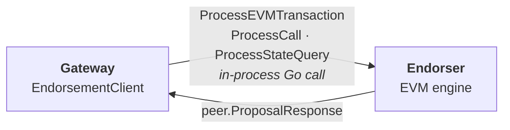
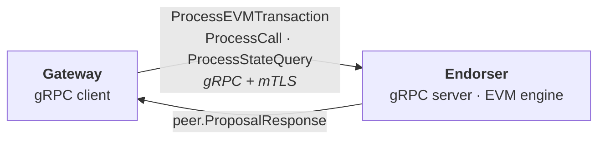

# Endorsement API Design — Overview

> This is part 0 of a multi-part design for a custom gRPC endorsement API
> exposed by the fabric-x-evm gateway's endorser component. It frames the
> problem, scope, and process. Later parts cover the proto/API, errors and
> security, the client/config/testing, and the implementation plan.

## Table of Contents

- [Motivation](#motivation)
- [Goals](#goals)
- [Non-Goals](#non-goals)
- [Related Issues](#related-issues)
- [Current Architecture](#current-architecture)
- [Target Architecture](#target-architecture)
- [Document Series](#document-series)
- [Open Questions](#open-questions)
- [Time Plan](#time-plan)
- [Collaboration and Cadence](#collaboration-and-cadence)
- [Risks](#risks)
- [Glossary](#glossary)
- [Decisions and Alternatives](#decisions-and-alternatives)

## Motivation

Today the gateway invokes the endorser through **in-process Go function
calls**. The gateway constructs an `EndorsementClient` that holds a slice of
`Endorser` interface values and calls them directly (see
[`gateway/core/endorse.go`](../../../gateway/core/endorse.go)). This works for
an embedded, single-binary deployment but does not support running the gateway
and endorser as separate processes or on separate hosts.

The goal is a **custom gRPC API, specialized for fabric-x-evm**, exposed by
each gateway's endorser component. It replaces the in-process calls with a
network boundary while preserving the exact semantics the gateway relies on
today. It is intentionally *not* a generic endorsement API - it is tailored to
the three operations fabric-x-evm actually needs.

The `Endorser` interface already anticipates this: its doc comment names
"local, gRPC client, mock" as intended implementations, so the gRPC client is a
drop-in behind the existing seam.

## Goals

- Expose a gRPC endorsement API from the endorser component that supports
  everything the gateway does today:
  - **Transactions** - endorse an executed Ethereum transaction.
  - **Calls** - execute a read-only `eth_call`.
  - **State queries** - read balance, code, storage, and nonce.
- Keep the proto schema **easy to understand, future-proof, and aligned with
  fabric-x-common naming** where possible.
- Preserve the current **error semantics** (reverts vs. execution errors vs.
  server errors) across the network boundary.
- Support **mTLS** and define the other security and resilience properties the
  boundary needs.
- Reuse known-working, efficient code from fabric-x-committer where it makes
  sense; document where we duplicate vs. depend vs. upstream to
  fabric-x-common.
- Land the change as a series of **small, low-disruption PRs** behind the
  existing `Endorser` interface.

## Non-Goals

- Replacing the Ethereum JSON-RPC surface the gateway exposes to clients - that
  stays unchanged.
- A generic, multi-application endorsement protocol - this API is specific to
  fabric-x-evm.
- Changing endorsement policy, MVCC validation, or the commit path.
- Dependency-aware scheduling and mempool retry (tracked separately in #50 and
  #59); the API must not preclude them, but they are out of scope here.

## Related Issues

- **Implements:** #22 (Implement gRPC Communication) - this design series is its
  design phase.

## Current Architecture

- The gateway's `EndorsementClient` fans out to one or more `Endorser`
  instances and collects signed `peer.ProposalResponse` values.
- The contract is the three-method `Endorser` interface in
  [`gateway/core/endorse.go`](../../../gateway/core/endorse.go).
- Responses are already Fabric `peer.ProposalResponse` messages, and
  transaction endorsement already flows through Fabric proposal machinery
  (`endorsement.Invocation`, `protoutil`).

## Target Architecture

- A new gRPC service on the endorser wraps the existing `Endorser`
  implementation; the gateway gets a gRPC-backed `Endorser` that satisfies the
  same interface.
- The boundary carries the same payloads that cross the in-process call today:
  a marshaled Ethereum transaction, the Fabric `Invocation`/proposal, call
  messages, and state-query descriptors - with `peer.ProposalResponse` coming
  back.
- Because the response type is already a Fabric proto and the request payloads
  are mostly Fabric/Ethereum-native bytes, the schema can largely **reuse
  existing types** rather than invent new ones.

## Document Series

| Part | File | Scope |
|------|------|-------|
| 0 | `00-overview.md` (this doc) | Problem framing, scope, process, time plan, risks |
| 1 | `01-api-and-proto.md` | Proto schema, RPC shape, serialization, streaming, committer alignment |
| 2 | `02-errors-and-security.md` | Error taxonomy, mTLS, security, resilience |
| 3 | `03-client-config-testing.md` | Endorsement client, configuration, testing |
| 4 | `04-implementation-plan.md` | Small-PR rollout sequence |

Each part ends with a **Decisions and Alternatives** section recording the
choices made and the options considered, so reviewers can follow the reasoning.

## Open Questions

These are resolved in later parts, but listed here so reviewers see them early:

- **RPC shape:** one reusable RPC vs. separate RPCs per operation.
- **Streaming:** do we keep a connection open (like the orderer) for
  throughput, or use unary calls?
- **Serialization:** which payloads reuse Fabric/Ethereum-native encodings vs.
  get new proto messages.
- **Code reuse:** duplicate the needed pieces from fabric-x-committer, depend
  on it directly, or move shared code into fabric-x-common (needs @senthil).
- **Security beyond mTLS:** authorization, and resilience (timeouts,
  retries, connection pooling, backpressure).

## Time Plan

Rough, structure-only sequencing - no hard deadlines. Design parts are
sequential PRs; implementation follows once the design is agreed.

| Phase | Work | Rough effort |
|-------|------|--------------|
| D1 | Overview + agreement on scope (this PR) | ~few days |
| D2 | Proto/API design (part 1) | ~1 week |
| D3 | Errors + security (part 2) | ~few days |
| D4 | Client, config, testing (part 3) | ~few days |
| D5 | Implementation plan (part 4) | ~few days |
| I1+ | Implementation in small PRs | per plan in part 4 |

## Collaboration and Cadence

- Design is shared as a series of PRs; async review on each is the default.
- A short sync is proposed at two points: after part 1 (proto/API) and before
  starting implementation, to lock the interface. More if useful.
- Escalation points where maintainer input is needed are flagged inline in each
  part (e.g. the fabric-x-common code-move question).

## Risks

- **Interface drift:** the boundary must exactly preserve current semantics
  (status codes, revert handling); a mismatch would surface as subtle receipt
  or error regressions.
- **Serialization fidelity:** Fabric proposal/response bytes must round-trip
  unchanged so signatures and proposal hashes stay valid.
- **Code-reuse decision:** duplicating fabric-x-committer code risks drift;
  depending on it risks coupling. The choice affects long-term maintenance.
- **Security surface:** exposing endorsement over the network adds an
  authenticated, authorized entry point that did not exist in-process.

## Glossary

- **Gateway** - component exposing the Ethereum JSON-RPC API and driving
  endorsement, ordering, and commit.
- **Endorser** - component that executes EVM transactions/calls against its
  state and produces signed proposal responses.
- **Invocation** - Fabric proposal machinery (TxID, nonce, creator, proposal,
  proposal hash) built for a transaction endorsement.
- **ProposalResponse** - the signed Fabric response carrying a status code,
  message, and payload.
- **Revert** - an EVM execution that reverts; endorsed and submitted so the
  receipt records `status=0`, marked with response status `201`.

